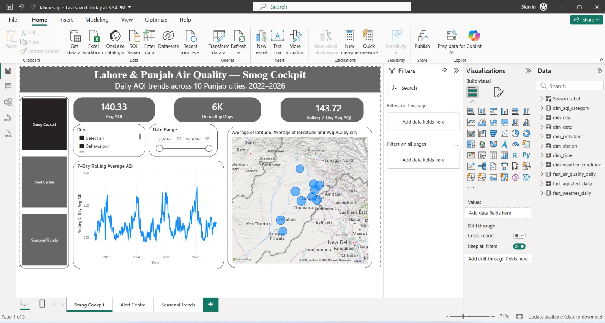
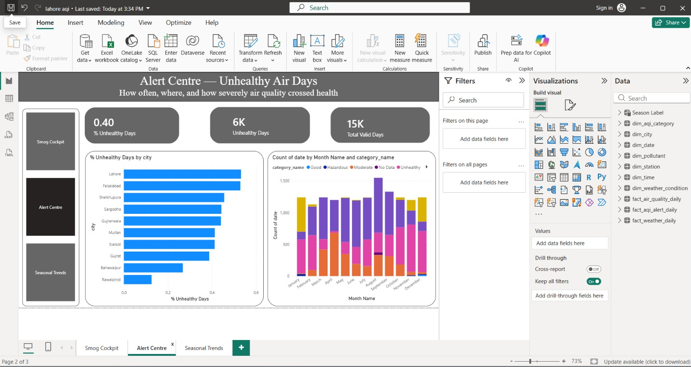
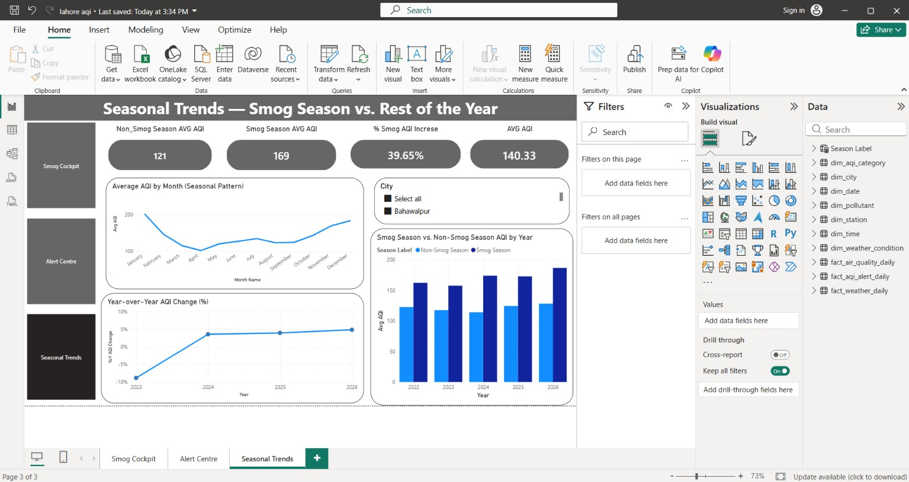

# Punjab Air Quality Analysis — Power BI Dashboard

An end-to-end analytics project tracking daily air quality and weather across 10 major cities in Punjab, Pakistan (2022–2026), built entirely in Power Query and DAX with a manually designed star schema.

## Overview

Punjab's cities, especially Lahore, regularly rank among the most polluted urban areas in the world, with severe smog concentrated in the October–February "smog season." This project collects, models, and visualizes ~4 years of daily air-quality and weather data across 10 cities to quantify exactly how much worse smog season is, which cities are most affected, and how the trend has changed year over year.

## Key Findings

- **Smog season is measurably worse, every single year.** Average AQI during Oct–Feb (169) is 40% higher than the rest of the year (121) — and this gap holds consistently across all 5 years studied, with no exceptions.
- **Lahore has the worst average air quality of the 10 Punjab cities analyzed**, followed closely by Faisalabad and Sheikhupura. Bahawalpur and Rawalpindi are consistently the cleanest.
- **Pollution has trended worse year over year since 2023** — after an initial improvement, year-over-year AQI change has climbed steadily, reaching roughly +5% by 2026.
- **A regional dust storm on May 23, 2025** pushed several central-Punjab cities into Hazardous territory *outside* smog season — a distinct phenomenon from typical winter smog, identified by its PM10-dominant signature (large dust particles) rather than the PM2.5-dominant signature of combustion smog.

## Dashboard Screenshots

### Smog Cockpit
At-a-glance status: current AQI, 7-day rolling trend, and a city map.

### Alert Centre
How often, where, and how severely air quality crosses into unhealthy territory.

### Seasonal Trends
Quantifying the smog-season effect and the year-over-year trend.

## Data Sources

- **Air quality (PM2.5, PM10, US AQI index):** Open-Meteo Air Quality API, built on the Copernicus Atmosphere Monitoring Service (CAMS) atmospheric composition model.
- **Weather (temperature, humidity, precipitation, wind, pressure):** Open-Meteo Historical Weather API, based on meteorological reanalysis.

**A note on data provenance:** these sources provide *modeled* estimates rather than direct ground-sensor readings from Pakistan's EPA or PMD networks. They were used because EPA and PMD do not currently expose a public bulk-download covering all 10 cities across this date range — EPA offers only a live dashboard, and PMD's historical data requires a manual request process. This is documented here transparently rather than presented as ground-truth government data.

## Data Model

A star schema built entirely in Power Query, with 3 fact tables and 7 dimension tables:

**Fact tables**
- `fact_air_quality_daily` — daily PM2.5/PM10/AQI readings per city
- `fact_weather_daily` — daily weather observations per city
- `fact_aqi_alert_daily` — derived daily alert flag (Unhealthy or worse)

**Dimension tables**
- `dim_city` (10 rows), `dim_date` (generated calendar, ~1,505 days), `dim_aqi_category` (7 rows, US EPA AQI breakpoints), `dim_weather_condition` (5 rows), `dim_pollutant` (2 rows, reference only), `dim_station` and `dim_time` (placeholders, since this dataset is city-level and daily-grain)

## Tech Stack

- **Power Query (M)** — data cleaning, validation, category derivation, key generation via merges
- **DAX** — 9 measures including rolling averages, seasonal comparisons, year-over-year change, and city ranking
- **Power BI** — 3 report pages (Smog Cockpit, Alert Centre, Seasonal Trends), with plans to extend to City Benchmark, Meteorology Relationship, and Data Completeness pages

## File

- `lahore aqi.pbix` — the full Power BI report file

## Related Project

This project's companion piece is a separate **SQL Server data warehouse** (Bronze/Silver/Gold architecture with stored procedures, built for a single Lahore monitoring station using official aqicn.org/US EPA historical data) — see [that repository] for the data-engineering-focused counterpart to this analytics project.
